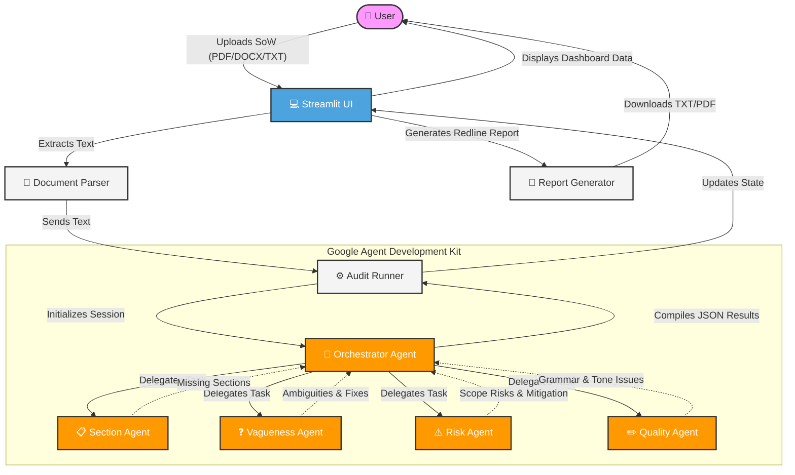

<div align="center">
  
  
  
  
  
</div>

<br/>

<div align="center">
  <h1>📋 Statement of Work (SoW) Audit Assistant</h1>
  <p><strong>AI-Powered Contract Analysis Tool driven by a Multi-Agent Architecture</strong></p>
</div>

---

## 🚀 Overview

The **SoW Audit Assistant** is an intelligent, multi-agent application designed to review Statement of Work (SoW) documents. By leveraging the **Google Agent Development Kit (ADK)** and the **Google Gemini** model, it accelerates the contract review process by up to 5x while significantly reducing the risk of scope creep.

Simply upload a PDF, DOCX, or TXT file, and our specialized AI agents will collaborate to analyze the document for structural completeness, ambiguous language, potential risks, and professional quality.

## ✨ Key Features

- **📑 Multi-Format Parsing**: Seamlessly extracts text from PDF, DOCX, and TXT files.
- **🤖 Multi-Agent Analysis**: Utilizes distinct, specialized AI agents orchestrated together to perform a comprehensive audit.
  - **Section Validation**: Checks for the presence of standard required sections (e.g., Deliverables, Timeline, Pricing).
  - **Vagueness Detection**: Flags ambiguous terminology and unquantified metrics.
  - **Risk Assessment**: Evaluates potential scope creep and business impact levels.
  - **Quality Check**: Ensures grammar, spelling, formatting, and professional tone.
- **📊 Interactive Dashboard**: A beautiful, Streamlit-powered UI featuring Plotly charts, metric cards, and drill-down tabs for detailed analysis.
- **📝 Automated Redlining**: Generates downloadable audit reports with specific text improvement suggestions that you can copy directly into your contracts.

## 🏗️ Architecture

The application is built on a modern, synchronous-to-asynchronous bridge architecture using Streamlit for the frontend and Google ADK for the backend. 



### Flow execution:
1. The **Document Parser** extracts clean text from the uploaded file.
2. The **Audit Runner** creates an in-memory session and calls the **Orchestrator Agent**.
3. The Orchestrator distributes context to the four specialized sub-agents.
4. The responses are aggregated, validated as JSON, and sent back to the Streamlit UI.
5. The UI dynamically renders charts, metrics, and detailed expanders for the user to explore.

## 📂 Project Structure

```text
ContractAudit/
├── app.py                  # Main Streamlit application
├── audit_runner.py         # ADK synchronous bridge and runner wrapper
├── document_parser.py      # PDF, DOCX, TXT parsing logic
├── report_generator.py     # Downloadable report construction
├── constants.py            # Configuration and constant variables
├── requirements.txt        # Project dependencies (via pyproject.toml typically)
├── .env                    # Environment variables (e.g., GEMINI_API_KEY)
├── assets/                 
│   └── style.css           # Custom UI styling and CSS
└── agents/                 # Google ADK Agents
    ├── __init__.py
    ├── orchestrator.py     # Root agent routing interactions
    ├── parser_agent.py     # Specialized parsing instructions
    ├── quality_agent.py    # Grammar & tone checking
    ├── risk_agent.py       # Scope creep evaluation
    ├── section_agent.py    # Required section validation
    └── vagueness_agent.py  # Ambiguity detection
```

## 🛠️ Installation & Setup

1. **Clone the repository:**
   ```bash
   git clone https://github.com/AadarshDubey/Sow.git
   cd ContractAudit
   ```

2. **Create a virtual environment:**
   ```bash
   python -m venv .venv
   source .venv/bin/activate  # On Windows use: .venv\Scripts\activate
   ```

3. **Install dependencies:**
   ```bash
   pip install -r requirements.txt
   # OR if using pyproject.toml
   pip install -e .
   ```

4. **Configure Environment Variables:**
   Create a `.env` file in the root directory and add your Google Gemini API key and any ADK tracing configuration:
   ```env
   GEMINI_API_KEY=your_api_key_here
   ```

## 🚀 Usage

Run the Streamlit application locally:

```bash
streamlit run app.py
```

The application will launch in your default web browser (typically at `http://localhost:8501`).

### How to use the app:
1. Drag and drop your SoW document.
2. Ensure "Enable AI-Powered Analysis" is checked.
3. Click "Analyze Document" and wait for the multi-agent orchestration to finish (usually 1-2 minutes).
4. Review your overall scores, explore the specific tabs for actionable insights, and download the full report.

## 🤝 Contributing

Contributions, issues, and feature requests are welcome! Feel free to check the [issues page](../../issues).

## 📄 License

This project is licensed under the [MIT License](LICENSE).
